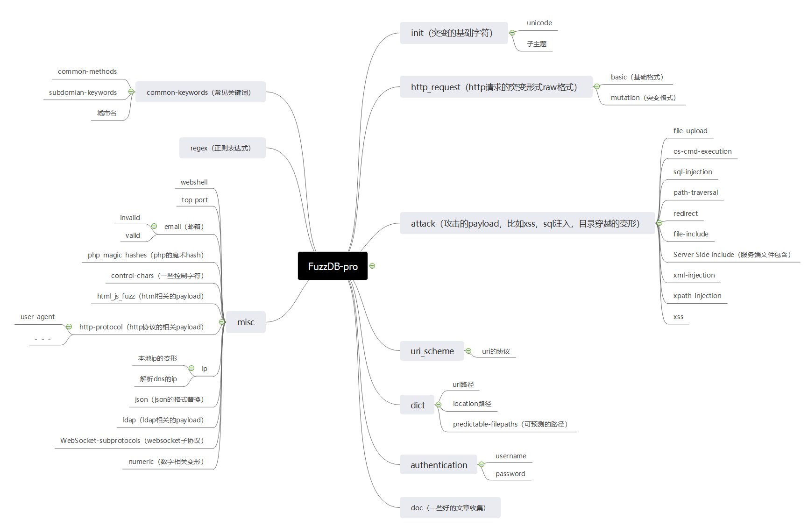

# FuzzDB-pro

在[FuzzDB](https://github.com/fuzzdb-project/fuzzdb)的基础上，重新分了类，添加了一些新增的payload。

使用场景：生成payload，1.burp中替换参数使用；2.自己编写的程序读取生成结果进一步的处理；3.添加到nuclei中使用

占位符：

| 占位符   | 说明              | 默认值        |
| -------- | ----------------- | ------------- |
| {init}   | 突变字符          | null空        |
| {target} | url跳转的目标地址 | www.baidu.com |
| {file}   | 实际存在的文件    | /etc/passwd   |
| {cmd}    | 执行的命令        | whoami        |

功能：

1. 将突变字符插入到payload中，形成新的payload，即{init}替换成突变字符，没有设置则为空
2. 修改{target}，{file}等占位字符，没有写的填写成默认值

3. username和password的配合，如生成username:password的base64结果

框架：

